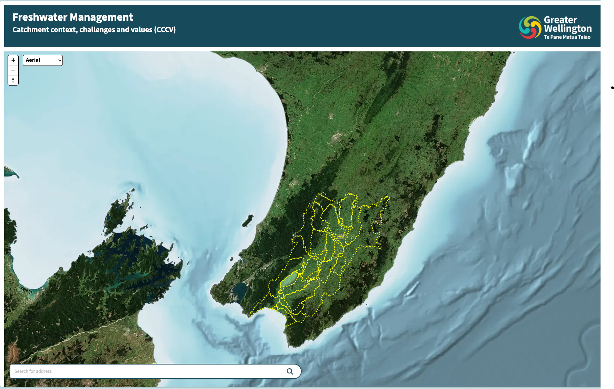
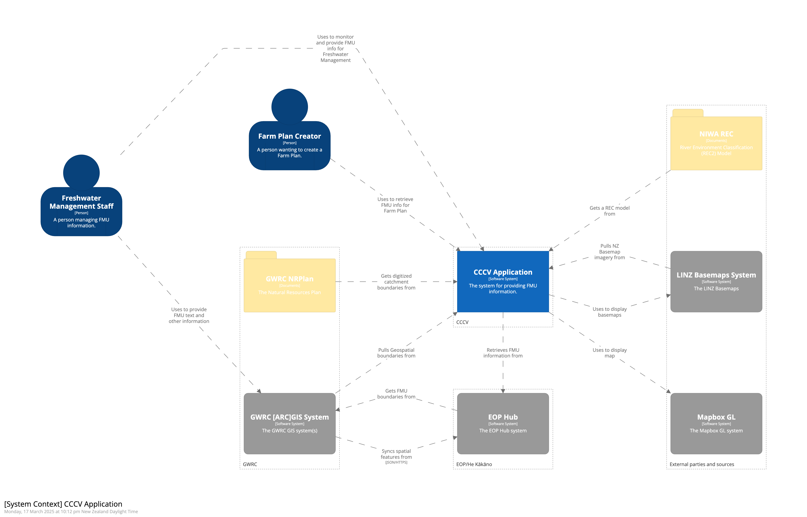
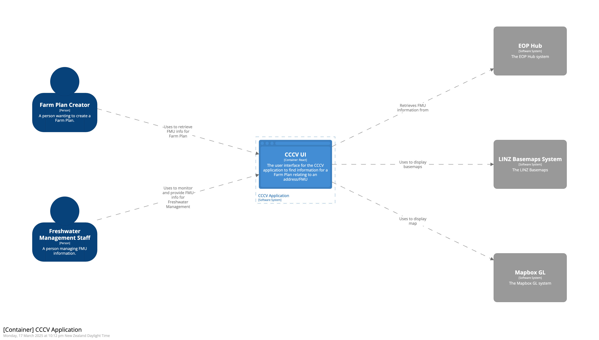

You can check out the CCCV app at
[https://cccv.eop.gw.govt.nz/](https://plan-limits.eop.gw.govt.nz/)

## Context

Freshwater users such as farmers are required to present plans to the 
government every five years showing how they will make use of ground and
surface water resources and what steps they will take to protect and preserve 
these and other valuable resources within their catchment. The CCCV app
neatly presents data and information about their catchment that they can use to 
inform their submission.   It complements another application built by an 
external party that the farmers can use to actually create and submit their farm plan.

## High-level architecture

The diagram below shows the high level technical architecture of the CCCV application

### Key areas:

#### CCCV Application

This is the front-end UI that end-users interact with to view CCCV. It's
deployed as static HTML/CSS/JS to [AWS Amplify](https://aws.amazon.com/amplify/) and served
via [AWS Cloudfront](https://www.amazonaws.cn/en/cloudfront/). It consumes data
from the Management API, the Tile Server and
[LINZ Basemaps](https://basemaps.linz.govt.nz/).

Key technologies:

- [Typescript](https://www.typescriptlang.org/) - Type safe language that
  transpiles to Javascript
- [React](https://reactjs.org/) - A JavaScript library for building user
  interfaces
- [Tanstack Query](https://tanstack.com/query/v4/) - Data loading and state
  management library
- [Tailwind CSS](https://tailwindcss.com/) - CSS framework
- [Mapbox GL](https://docs.mapbox.com/mapbox-gl-js/guides/) - Mapping Library

#### Manager API

This is a server-side application that exposes APIs for the All of the EOP He Kākāno apps. The Manager provides endpoints to:

- Retrieve a list of Frashwater Management Units and their boundaries
- Retrieve Plan and Consent data related to each FMU
- Retrieve LINZ Basemaps
- Retrieve address matching information and address parcel data from [AddressFinder](https://portal.addressfinder.net/) and [LINZ Basemaps](https://basemaps.linz.govt.nz/)
- Other council specific GIS data (pulled periodically from ARCGIS)
- Plan and Consent data, consumed from an internal Kafka Broker

The Manager API, like all EOP/He Kākāno backend components is deployed in Docker Containers using
[Amazon ECS](https://aws.amazon.com/ecs/). Key technologies include:

- [Kotlin](https://kotlinlang.org/) - A modern JVM language
- [Spring Boot](https://spring.io/projects/spring-boot) - A production grade
  Application Framework
- [jOOQ](https://www.jooq.org/) and [Flyway](https://flywaydb.org/) - Data
  access and management libraries

#### Vector Tile Server

This is a simple containerised deployment of
[pg_tileserv](https://github.com/CrunchyData/pg_tileserv), which connects to the
database and serves NZ River spatial data directly to the Web Application as Vector
Tiles.

#### Database

This is a Postgres database with PostGIS extensions installed deployed via
[AWS RDS](https://aws.amazon.com/rds/).

### Hosting

The solution is currently hosted on AWS leveraging managed services where
possible, and making use Terraform to ensure infrastructure and configuration is
defined as code.
