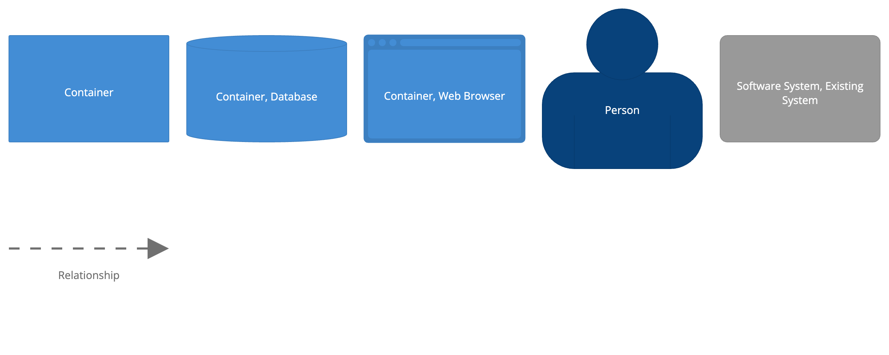

## Overview

This site is built using [Gatsby](https://www.gatsbyjs.com/) and hosted in
GitHub pages. Any changes made under `docs-site` in this repo will automatically
be published when pushed to the `main` branch in GitHub.

On top of the basic configuration Gatsby has been configured to build pages from
markdown files, to simplify adding new content.

See the readme in the `docs-site` folder for more information on how to update
the documentation.

Here is a simple key to the diagrams used in this documentation:

See the top level Readme for more information on how to work with Structurizr.