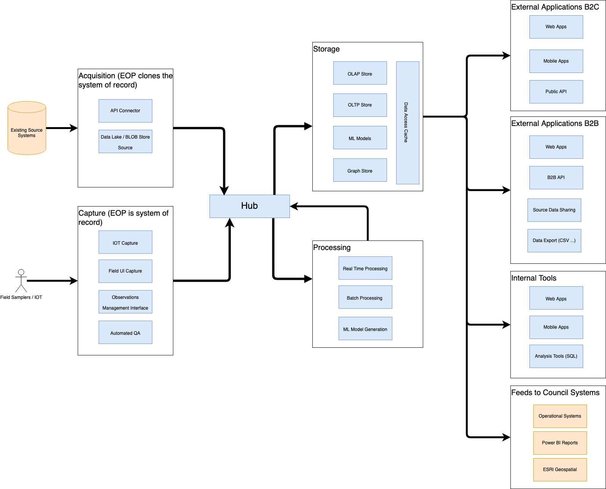

> This design is still subject to change as EOP evolves. In particular, it has
> been developed without the scope intended by the proposed Environmental Data
> Management System (EDMS) solution being clear. That may impact the scope of
> what EOP does

## Principals

These are the principles that drive the design and development of EOP.

- **Leverage existing data** - Enable councils to reuse existing data and 
integrate this in ways that produce outcomes that are currently difficult.

- **Design and delivery iteratively** - Plan for the future, but start small and
iterate, ensuring value and outcomes are delivered early.

- **Support real-time and batch** - Design to support real-time and batch
processing. Use the data and outcomes to drive which is required, rather
than technical choices and constraints. 

- **Plan for scale** - Anticpate and design for the scale required to support
the needs of multiple councils.

- **Designed for integration** - Enable EOP to integrate well with other system
including systems of record and services that EOP can add value to.

## Structure

EOP is being developed as a hub and spoke model. Data is captured or acquired
from external sources and sent to a central hub in a raw format. This can then
be consumed for procesing and storage by multiple components depending on needs.

As an example, the same data captured in the Hub might be subsequently stored in
a data warehouse for analysis, and also processed in realtime for operational
alerting.

[Kafka](https://kafka.apache.org/) has been chosen as a scalable, loosely-coupled
Hub, with well supported connectors to other systems. Kafka is often used
for real time processing, and is also well suited to consuming data that from
batch processes.

The following diagram shows the high-level relationship between the different
classes of components that will be delivered around the hub

### Acquisition

Acquisition components support ingestion of data from existing systems into EOP.
These might be existing council systems or third party systems housing data
which EOP can make use of. Acquisition will be the the initial focus for EOP.

The preference is for councils to push data to EOP, rather than for EOP to pull.
This allows councils to control the frequency of updates. However, there will be
some cases where pulling data from a system is required, such as data from third
party systems that can't be changed.

A special case is Hilltop. Because of its wide-use and existing APIs, EOP will
support pulling data from council Hilltop instances.

Example Acquisition components:

- JSON API's exposed to councils
- Data lake / Blob storage style end points for bulk data
- Hilltop API
- Direct connection from Kafka Connectors running in council environments

### Capture

Capture components support ingestion of data where EOP is the system of record.
These will be developed when there is an opportunity to improve on existing data
capture tools for all councils, such as supporting newer data-standards or
capturing meta-data not-supported by existing systems.

This type of component is a longer term goal for the EOP.

Example Capture components:

- Field capture user interface that may be running on a mobile device
- IOT endpoints for capturing data from sensors
- User interfaces for QA review

## Data Stores

Data store components are about storing data in a way that is appropriate for
the type of analysis being performed. The data storage type being used drives
the types of queries that can be performed and the type of information that can
be derived. By using the hub and spoke model with Kafka as the hub, EOP can stay
agnostic of the data stores that are used, rahter than tying the solution to a
specific type of analysis.

Example Data store components:

- OLTP database for fast operational access
- OLAP database for slower analytical access
- Graph database for network analysis

## Processing

Processing components are there to perform analysis on the data that is stored
in EOP.

The processing components are loosely coupled to the data stores. The intention
is for this to be a key extension point for adding new analysis processes to EOP
without changing other components.

Example Processing components:

- Real time processing has driven off kafka streams
- Batch processing driven data in the OLAP data stores
- Data science scripts (R / Python) for analysis e.g. Naturalised flow
- AI model training

## Output

Output components systems take information captured in EOP and present it to
users as usable outcomes. The diagram shows the output components grouped by the
type of user that they are intended for. That is to draw attention to the fact
that delivering an outcome may be presented differently depending on the
consumers even though they may be in the same type of technology.

Example Processing components:

- UI Viewers
- API endpoints
- Bulk data downloads

### External Applications B2C

Applications that general public are intended to consume, for these there needs
to be a focus on the user experience making the tools valuable for the user.

### External Applications B2B

Applications that are intended to be used by third party organisations including
central government. The information returned may have a focus on providing for
specific questions. These types of application may be more focused on
information exported for use in third party systems

### Internal Tools

Tools that are used by council staff to perform their day to day work. These
applications need a user experience that is task focused for the type of person
using them and may expect a higher level of expertise when understanding the
data.

### Feeds to Council Systems

Feeds to council systems where EOP has created information that is then fed back
to existing council systems for presentation
