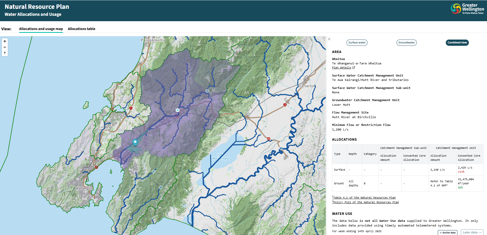
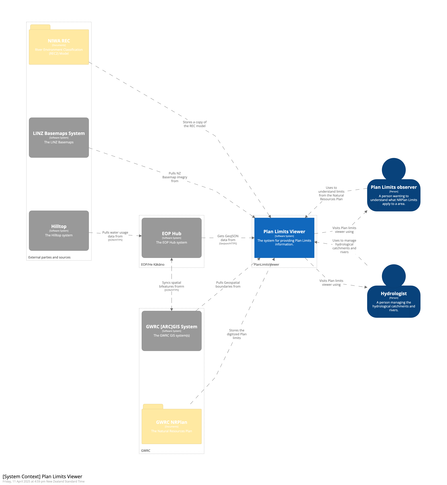
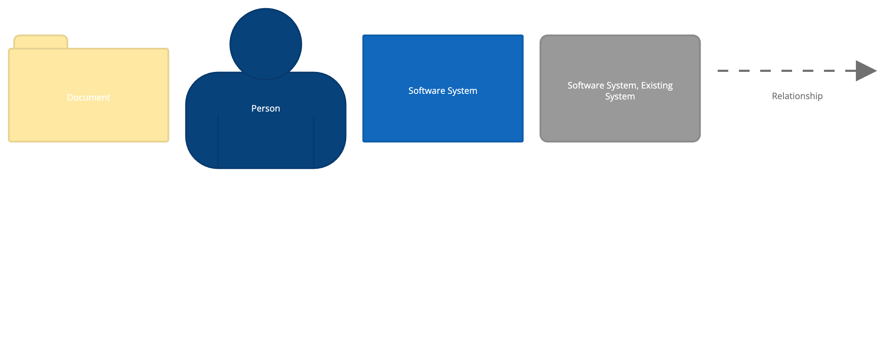
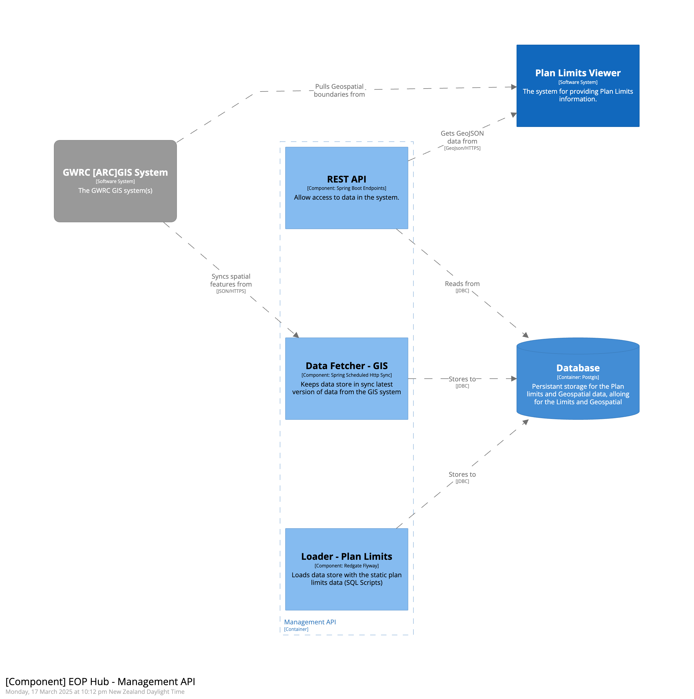
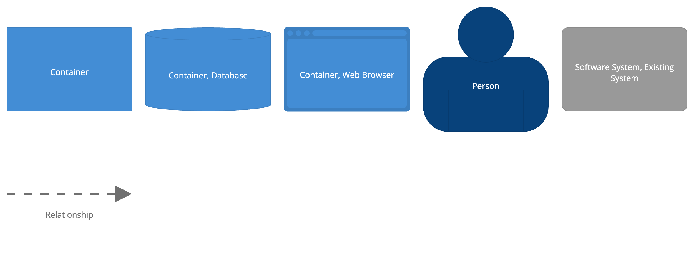

You can check out the Plan Limits Viewer at
[https://plan-limits.eop.gw.govt.nz/](https://plan-limits.eop.gw.govt.nz/)

## Context

Regional Councils create plans which set out objectives and policies that govern
usage of that Region’s resources. These plans contain measurable limits or
targets that can be compared to environmental observations or consents data to
help understand how the council is performing against these limits.

These plans are generally published in text based formats such PDF files,
referencing Geospatial boundaries coming from Council GIS systems. For
end-users, this means large amounts of text often containing complex rules need
to be read and understood to know what limits apply to which areas. This format
also makes it is difficult to build digital solutions that can compare these
limits to other data sets.

The Plan Limits Viewer digitises these rules alongside the GIS data they
reference, allowing a user to easily understand what limits apply where. It has
been developed with Greater Wellington data sources as a starting point, and
we're currently in the process of integrating data from other councils.

## High-level architecture

The diagram below shows the high level technical architecture of the Plan Limits
system

### Key areas:

#### Web Application UI

This is the front-end UI that end-users interact with to view Plan Limits. It's
deployed as static HTML/CSS/JS to [AWS S3](https://aws.amazon.com/s3) and served
via [AWS Cloudfront](https://www.amazonaws.cn/en/cloudfront/). It consumes data
from the Management API, the Tile Server and
[LINZ Basemaps](https://basemaps.linz.govt.nz/).

Key technologies:

- [Typescript](https://www.typescriptlang.org/) - Type safe language that
  transpiles to Javascript
- [React](https://reactjs.org/) - A JavaScript library for building user
  interfaces
- [Tanstack Query](https://tanstack.com/query/v4/) - Data loading and state
  management library
- [Tailwind CSS](https://tailwindcss.com/) - CSS framework
- [MapLibre](https://maplibre.org/projects/) - Mapping Library

#### Management API

This is a server-side application that exposes APIs for the Plan Limits Viewer
to consume data. The Manager is also responsible for updating various data
sources that the Plan Limits Viewer is based on included:

- Infrequently changing data GIS from LINZ (such as the NZ River data), imported
  in batch
- Councils specific GIS boundary data, pulled periodically from ESRI APIs
- Plan and Consent data, consumed from an internal Kafka Broker

The application is deployed in a Docker Containers using
[Amazon ECS](https://aws.amazon.com/ecs/). Key technologies include:

- [Kotlin](https://kotlinlang.org/) - A modern JVM language
- [Spring Boot](https://spring.io/projects/spring-boot) - A production grade
  Application Framework
- [jOOQ](https://www.jooq.org/) and [Flyway](https://flywaydb.org/) - Data
  access and management libraries

#### Ingest API

This is a server-side applications which exposes authenticated APIs to accept
incoming Plan and Consent data from Councils, and persist this to a Kafka
Broker. It's developed and deployed using the same technology stack as the
Management API.

#### Vector Tile Server

This is a simple containerised deployment of
[pg_tileserv](https://github.com/CrunchyData/pg_tileserv), which connects to the
database and serves NZ River GIS data directly to the Web Application as Vector
Tiles.

#### Database

This is a Postgres database with PostGIS extensions installed deployed via
[AWS RDS](https://aws.amazon.com/rds/).

#### Kafka Broker

This is a standard Kafka Broker deployed using
[AWS EKS](https://aws.amazon.com/eks/).

### Hosting

The solution is currently hosted on AWS leveraging managed services where
possible, and making use Terraform to ensure infrastructure and configuration is
defined as code.
