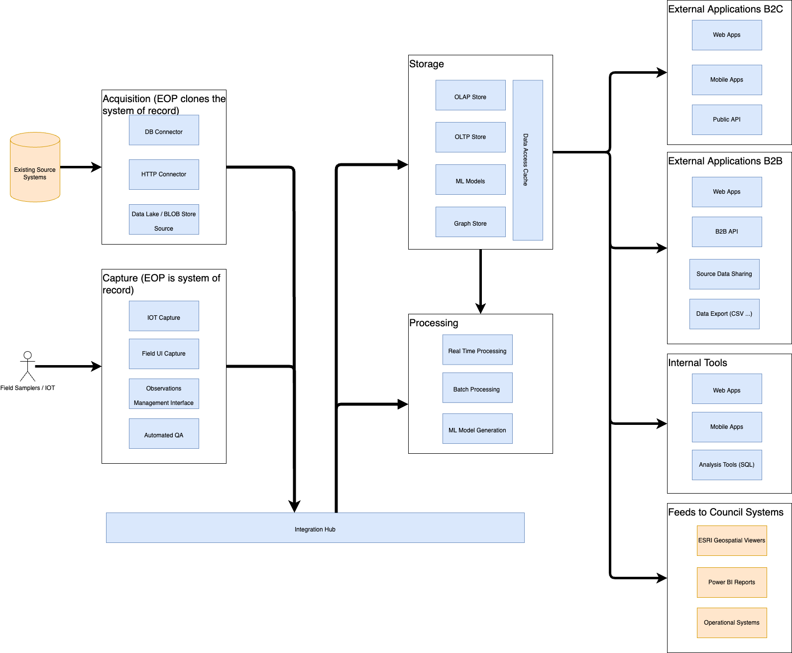

> This design is still subject to change as EOP evolves. In particular, it has
> been developed without the scope intended by the proposed Environmental Data
> Management System (EDMS) solution being clear. That may impact the scope of
> what EOP does

## Principals

These are the principles that drive the design and development of EOP.

- **Leverage existing data** - Enable councils to reuse existing data and
  integrate this in ways that produce outcomes that are currently difficult.

- **Design and delivery iteratively** - Plan for the future, but start small and
  iterate, ensuring value and outcomes are delivered early.

- **Support real-time and batch** - Design to support real-time and batch
  processing. Use the data and outcomes to drive which is required, rather than
  technical choices and constraints.

- **Plan for scale** - Anticipate and design for the scale required to support
  the needs of multiple councils.

- **Designed for integration** - Enable EOP to integrate well with other system
  including systems of record and services that EOP can add value to.

## Structure

EOP is being developed as a hub and spoke model. Data is captured or acquired
from external sources and sent to a central hub in a raw format. This can then
be consumed for processing and storage by multiple components depending on
needs.

As an example, the same data captured in the Hub might be subsequently stored in
a data warehouse for analysis, and also processed in realtime for operational
alerting.

[Kafka](https://kafka.apache.org/) has been chosen as a scalable,
loosely-coupled Hub, with well supported connectors to other systems. Kafka is
often used for real time processing, and is also well suited to consuming data
that from batch processes.

The following diagram shows the high-level relationship between the different
classes of components that will be delivered around the hub

### Acquisition

Acquisition components support ingestion of data from existing systems into EOP.
These might be existing council systems or third party systems housing data
which EOP can make use of. Acquisition will be the the initial focus for EOP.

The preference is for councils to push data to EOP, rather than for EOP to pull.
This allows councils to control the frequency of updates. However, there will be
some cases where pulling data from a system is required, such as data from third
party systems that can't be changed.

There will be special cases for tools that are ubiquitous across the councils
that EOP can pull from standard interfaces without per council integration. For
example, ESRI and Hilltop.

Example Acquisition components:

- JSON API's exposed to councils
- Data lake / Blob storage style end points for bulk data
- Pulling from Hilltop / ESRI API's
- Direct connection from Kafka Connectors running in council environments

### Capture

Capture components support ingestion of data where EOP is the system of record.
These will be developed when there is an opportunity to improve on existing data
capture tools for all councils, such as supporting newer data-standards or
capturing meta-data not-supported by existing systems.

This type of component is a longer term goal for the EOP.

Example Capture components:

- Field capture user interface that may be running on a mobile device
- IOT endpoints for capturing data from sensors
- User interfaces for QA review

### Data Stores

Multiple data store components may be used to allow modelling and querying based
on the type analysis required.

Using a Hub and Spoke model allows the EOP to remain agnostic of the data store
solutions used now and in the future.

Example Data store components:

- OLTP database for fast operational access
- OLAP database for slower analytical access
- Graph database for network analysis

### Processing

Processing components perform analysis on the data stored in EOP.

These are decoupled from the data stores, and designed to be a key extension
point for adding new analysis capability without affecting other components.

Example Processing components:

- Real time processing, driven from kafka streams
- Batch processing, driven from data in OLAP data stores
- Data science scripts (R / Python) for analysis e.g. Naturalised flow
- AI model training

### Output

Output components present information captured and generated by EOP to various
types of users, with a focus on outcomes.

The diagram shows these grouped by the type of user emphasise a user-centric,
rather than technology-centric approach. E.g. multiple web applications or APIs
may be developed to serve difference audiences.

Example Processing components:

- UI Viewers
- API endpoints
- Bulk data downloads

#### External Applications B2C

Applications intended for public use. These should be focussed on presenting
information and outcomes in a user-friendly way.

#### External Applications B2B

Applications intended for use by third-party organisations including central
government. This could be information for particular types of reporting, often
provided as exports for use in third party systems.

#### Internal Tools

Tools used by council staff to perform day-to-day work. These might
task-focussed applications, developed for users with particular expertise in the
data.

#### Feeds to Council Systems

These may be useful where EOP has created information that is valuable for
presentation by existing council systems.
