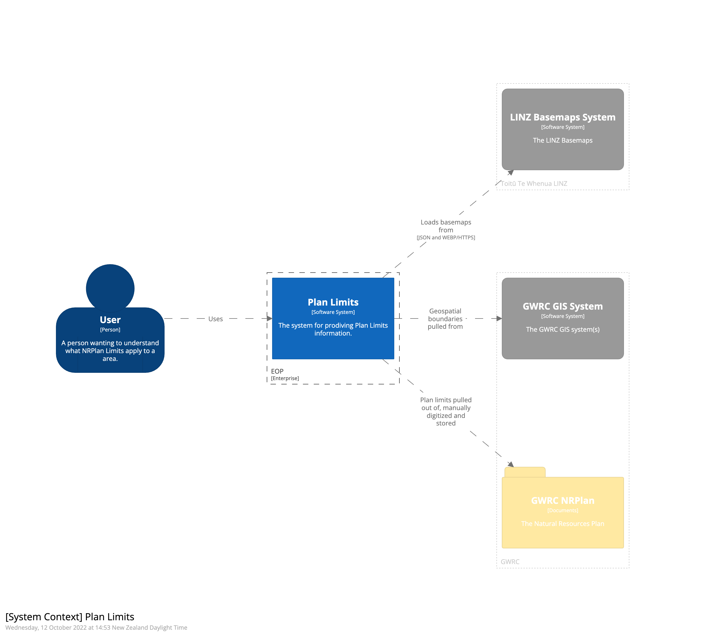
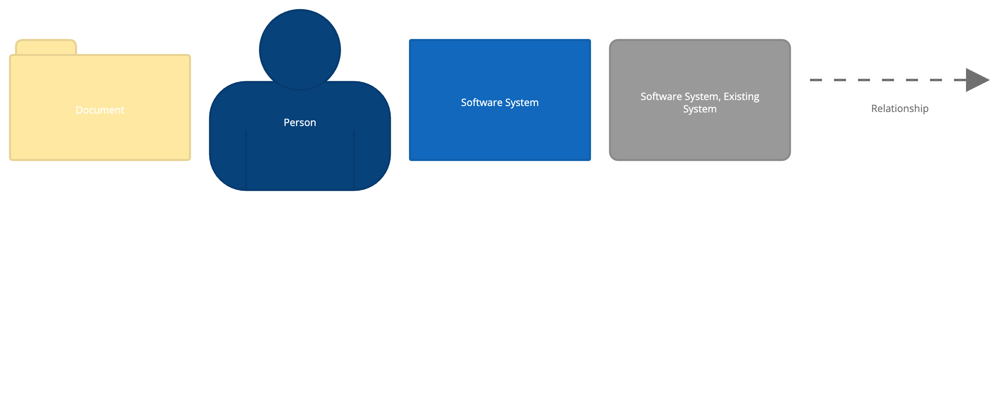
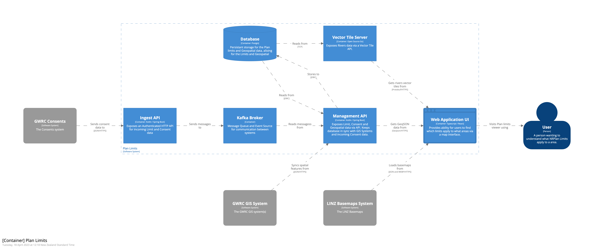
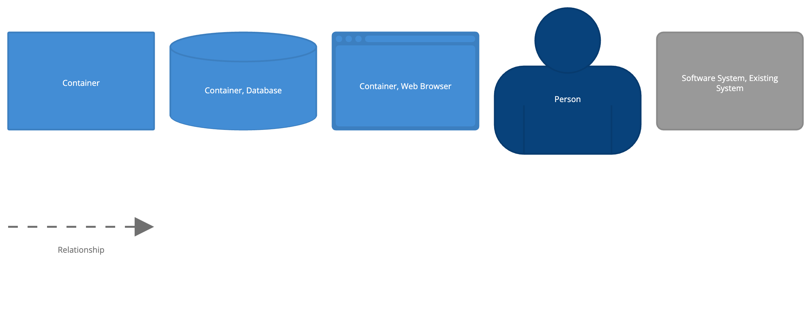
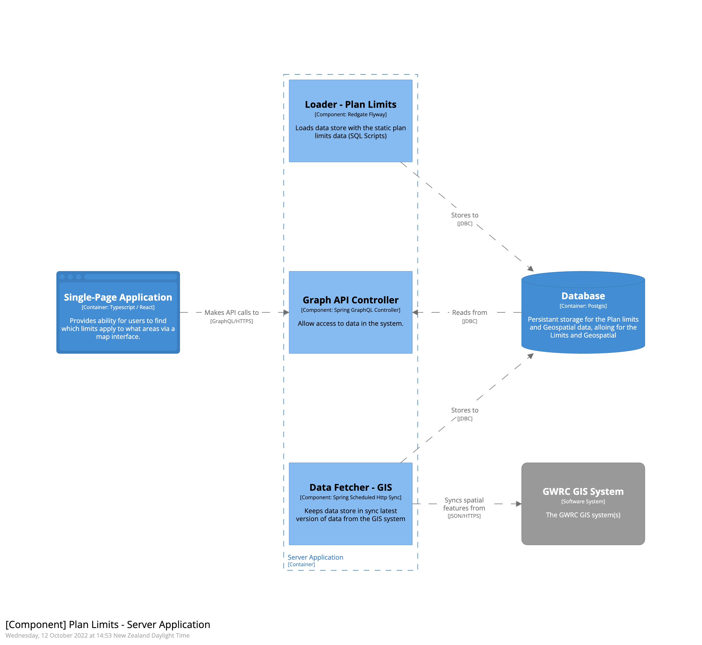
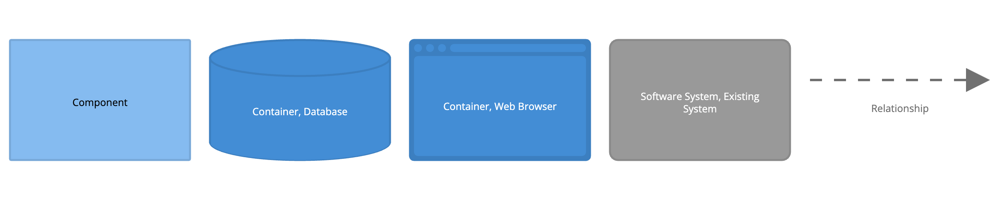

This page describes the work currently in progress around for the the Plan Limits viewer. 

---

## Context

Regional Councils create plans for their regions. They set out the objectives, policies and methods for people and organisations that use the Region’s resources. These plans contain measurable limits (or targets) that can be compared to environmental observations or consents data to help understand how the council is performing against these limits.

These plans a generally mastered in text based documents, i.e. PDF files with Geospatial boundaries coming from Council GIS systems. This means that for a user, it requires parsing large amounts of text to identify / understand what limits apply to which areas. This has a secondary effect that means it is difficult to build digital solutions that can compare these limits to other data sets.

The Plan Limits software system pulls together the information from the PDF documents and the GIS systems allowing a user to easily understand what limits apply to a geospatial feature.

## Containers

Information about the software architecture of the Plan Limits software system.

### Single Page Application

The single page application is what human consumers of the Plan Limits system will interact with. It is deployed as static HTML/CSS/JS that pulls its data from the API's exposed by the Backend Server and Basemaps exposed from [LINZ](https://basemaps.linz.govt.nz/) to provide high quality maps that cover all of New Zealand.  

Key libraries:

* [Typescript](https://www.typescriptlang.org/) - Type safe language that transpiles to Javascript
* [React](https://reactjs.org/) - A JavaScript library for building user interfaces
* [Vite](https://vitejs.dev/) - Javascript build tool
* [Tanstack Query](https://tanstack.com/query/v4/) - State management / data loading for front end
* [Tailwind CSS](https://tailwindcss.com/) - CSS framework
* [MapLibre](https://maplibre.org/projects/) - Mapping Library
* [Cypress](https://www.cypress.io/) - UI Testing framework

### Server Application 

The server application provides functionality for populating the Database with data that has been replicated from the source systems, storing it in a model for processing and making that available via an API.

Diagram below shows the key features of the server application, the intention is to start with a monolith type application and split it if/when the 

Key features: 
* Graph API Controller - Provides API data access to the plan limits information, exposed for programmatic access and from the UI Application. 
* Data Fetcher - GIS - Scheduled job that pull spatial information from Council GIS system and store in the data store 
* Loader - Plan Limits - Loads the plan limits information into the data store, different from a data fetcher as the digitized data can live as part of source control, and be updated when code is released.    

Key libraries: 

* [Kotlin](https://kotlinlang.org/) - Modern JVM language on top of JVM
* [Spring Boot](https://spring.io/projects/spring-boot) - Production Grade Application Framework

### Database

The database provides persistent storage for the information loaded from the Plan and GIS.

## Deployment