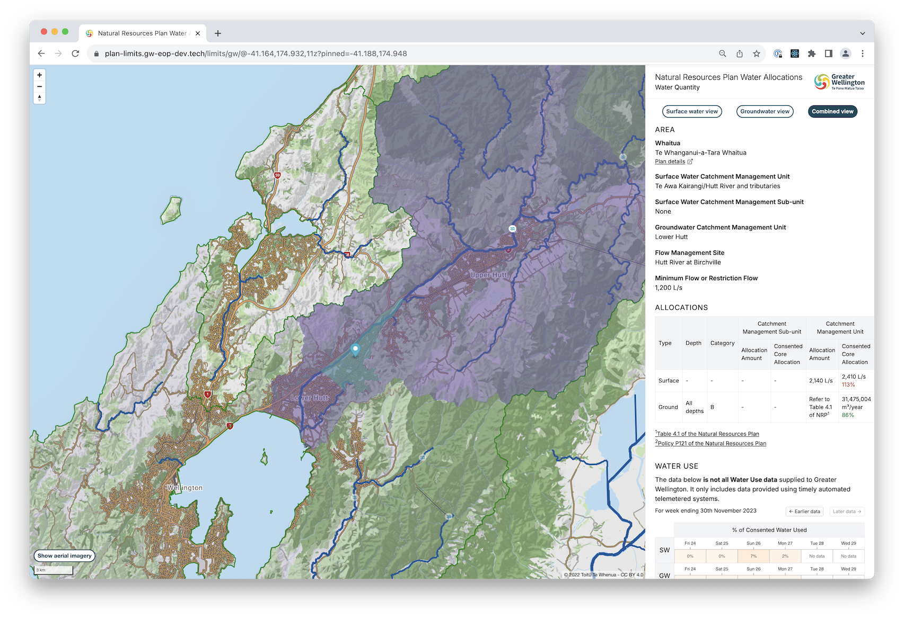

# Natural Resources Plan - Water Allocations Viewer

The Water Allocations Viewer is a web app allowing water allocation and usage relating to the Natural Resources Plan areas to be viewed.

It's built using React and React-Router and bundled using Vite.

The app displays a map using react-map-gl showing a base layer from LINZ. It water allocation and usage data the [EOP Manager API](../Manager/) via React-Query.

It makes use of [Nivo](https://nivo.rocks) for more advanved visualisation of the data.



## Getting Started

### Prerequisites

* Node
* The [EOP Manager API](../Manager/) and supporting services

### Setup
- Run `npm install`
- Copy `.env.local.template` to `.env.local`, and populate with a valid [LINZ Basemap Api Key](https://basemaps.linz.govt.nz).

### Running
```bash
npm run dev
```

### Running tests
```bash
npm run test
```

### Code Linting and Formatting
```bash
npm run check
```

Code is formatted using [Prettier](https://github.com/diffplug/spotless)

### Deployment
Deployment is to AWS Amplify which is connected to certain git branches.

- Pushing to the branch `deploy/plan-limits-ui/dev` will deploy to the development envrionment, [https://plan-limits.gw-eop-dev.tech](https://plan-limits.gw-eop-dev.tech).
- Pushing to the branch `deploy/plan-limits-ui/stage` will deploy to the staging envrionment, [https://plan-limits.gw-eop-stage.tech](https://plan-limits.gw-eop-stage.tech).
- Pushing to the branch `deploy/plan-limits-ui/prod` will deploy to the staging envrionment, [https://plan-limits.eop.gw.govt.nz](https://plan-limits.eop.gw.govt.nz).
- Pushing to a branch prefixed with `deploy/plan-limits-ui/review/` will create a new Amplify review envrionment linked to the dev Manager API, which is accessible from a URL with the format `https://deploy-plan-limits-ui-branch-suffix.d2qauh5z55065f.amplifyapp.com/limits/gw/usage`
