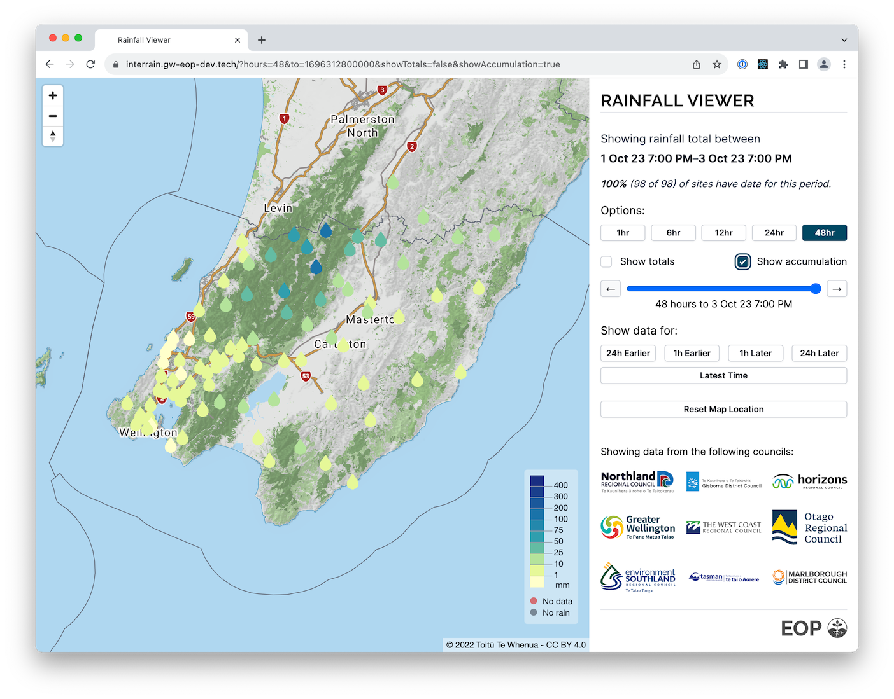

# EOP Rainfall Viewer Prototype (AKA InterRain)

InterRain is a prototype developed to illustratate the value in aggregating rainfall observations across council boundaries and presenting it in a user-friendly map-based UI.

It's built using [Next.js](https://nextjs.org/) and bootstrapped with [`create-next-app`](https://github.com/vercel/next.js/tree/canary/packages/create-next-app).

The app displays a map using react-map-gl showing a base layer from LINZ. It fetches rainfall observation data from the [EOP Manager API](../Manager/) via SWR, and renders this using icons. It also allows the user to navigate to different areas and time periods, customise the display, and share the current view via the URL.

Local development depends on the EOP Manager and supporting services. The rest of this doc is the readme generated by create-next-app.

## Getting Started

### Prerequisites

* Node
* The [EOP Manager API](../Manager/) and supporting services

### Setup
- Run `npm install`
- Copy `.env.local.template` to `.env.local`, and populate with a valid [LINZ Basemap Api Key](https://basemaps.linz.govt.nz).

### Running locally
- Run `npm run dev`

### Code Linting and Formatting
- Run `npm run lint`

### Deployment
Deployment is to AWS Amplify which is connected to certain git branches.

Pushing to the branch `deploy/interrain-ui/dev` will deploy to the development envrionment, [https://interrain.gw-eop-dev.tech](https://interrain.gw-eop-dev.tech).

Pushing to the branch `deploy/interrain-ui/stage` will deploy to the staging envrionment, [https://interrain.gw-eop-stage.tech](https://interrain.gw-eop-stage.tech).

